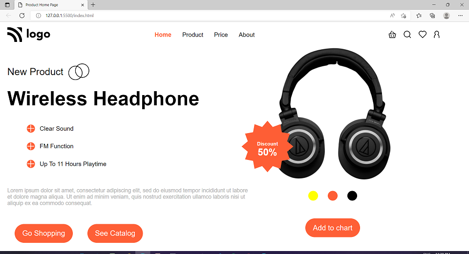

# Project-07 - A-Product-Home-Page

## Description:

> A Product's home page with more details about its specifications which will help the potential buyer to know more about the product and will help raise the sales of the product.

# 

**Landing-Page-Image:**

#

## What I have learnt while making this project?

> This project was a bit challenging, as it helped me learn a lot about positioning of child div elements with text and aligning it with big and small images & Div at the same time.

#

## Time taken to complete this project:
> Around 5hrs.

#

## See this project in action at below link:

**[Click to redirect to Project-07](https://p7-listen-well.netlify.app/)**

#

## Developed by:

**Sidharth Pandey**

**[Contact Me](mailto:sidp0008@gmail.com)**

#